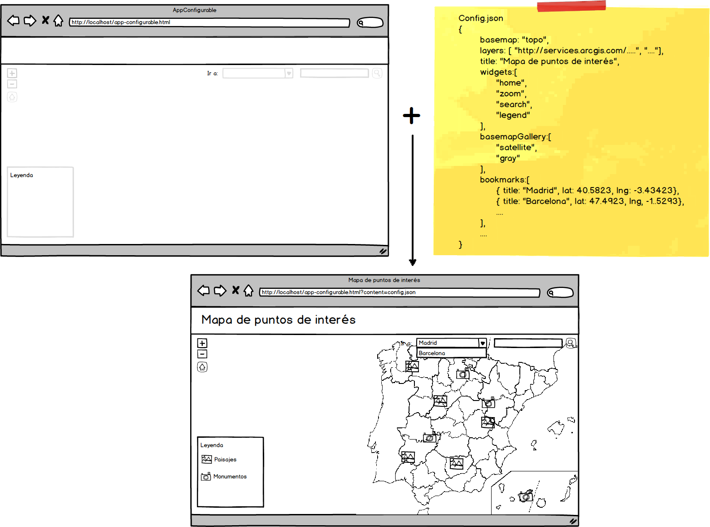

<!-- .slide: class="title" -->
## Aplicaciones configurables personalizadas

[Raúl Jiménez](http://geodevelopers.org/members/139909072) - [bit.ly/devsummit8](http://esri-es.github.io/devsummits-esri-spain/2016/aplicaciones-configurables-personalizadas)

---

<!-- .slide: class="agenda" -->

## En esta sesión veremos

* Qué son las aplicaciones configurables
* Qué se enconde detrás de las aplicaciones configurables
* Cómo podemos crearlas desde cero
* En qué casos nos ayudarán a ahorrar tiempo y dinero.

---

<!-- .slide: class="section" -->

## Qué son las apps configurables

---

<!-- .slide: class="background" -->

> Las también llamadas en ocasiones **plantillas**, son un mecanismo
que permite a usuarios de una organización crear y configurar
**aplicaciones web** sin necesidad de escribir código

---

<!-- .slide: class="white-background" -->

---

<!-- .slide: class="section" -->

## ¿Qué se esconde detrás?

---

 

  
 

---

<!-- .slide: class="background" -->

* Ahora:
 * [Crearemos una aplicación configurable](http://www.arcgis.com/home/webmap/viewer.html?layers=b070a29a32ee429888ff8c94ba298493)
 * [Inspeccionemos los items](http://www.arcgis.com/home/webmap/viewer.html?layers=b070a29a32ee429888ff8c94ba298493)

---

<!-- .slide: class="section" -->

## Crear una app configurable desde cero

---

<!-- .slide: class="background" -->

### Pasos para crear una app configurable

1. Crear [código inicial](demo/plantilla-configurable.html)

2. Crear item -> Aplicación -> Web Mapping -> Configurable

3. Editar -> "Parámetros de configuración" y añadir [estos](demo/parametros-configuracion.json) ([+info](http://doc.arcgis.com/es/arcgis-online/create-maps/configurable-templates.htm#ESRI_SECTION1_9165F0B2724E49F5ACC9C3DF7578DAB1))

4. Compartir -> Con un [grupo de tu organización](http://www.arcgis.com/home/groups.html)

5. Ir a la [configuración de tu organización](http://hhkaos2.maps.arcgis.com/home/organization.html):

  5.1 Editar ajustes -> Mapa -> Aplicaciones configurables

  5.2 Selecciona el grupo (no marques el checkbox)

  5.3 **Guardar**

---

<!-- .slide: class="background" -->

## Pasos para probar nuestra nueva app

1. Abrimos [un webmap](http://www.arcgis.com/home/webmap/viewer.html?webmap=f2e9b762544945f390ca4ac3671cfa72)

2. Guardamos en nuestra organización

3. Luego: Compartir -> Crear app -> &lt;nuestra plantilla&gt;

4. Introducimos título, guardamos y cerramos.

5. Abrimos la app

6. Terminamos el código

7. Si es necesario actualizamos el item de nuestra plantilla 
   para introducir la URL de la app en producción

---

<!-- .slide: class="section" -->

## Cuándo debo crear una app configurable

---

<!-- .slide: class="background" -->

> **Caso 1**:  
Cuando necesites crear varias aplicaciones web con las mismas funcionalidades o
muy similares donde sólo van a cambiar algunos parámetros.
  <small>O si ya has creado varias y actualizar estos parámetros te consume mucho tiempo</small>

---

### Posibles parámetros

* **La interfaz gráfica**: logotipos, colores,  
	layout, textos estáticos, etc.

* **Los datos**: mapa base, capas, simbología,  
	marcadores (accesos directos), etc.

* **Widgets**: activar o desactivar widgets

* Etc.

---

> **Caso 2**:  
Si has creado una aplicación donde los parámetros
mecionados anteriormente cambian con frecuencia y
quieres que un usuario no desarrollador pueda modificar
estos parámetros.

---

<!-- .slide: class="background" -->

### Ventajas a nivel de desarrollo

* Algunas de las ventajas que proporcionan:

  * Simplica el mantenimiento

  * No necesitamos crear una base de datos para almacenar los parámetros

	* Podemos reutilizar los usuarios y grupos de 
		nuestra organización para configurar quién tiene  
		acceso a cada plantilla.

	* Los usuarios que decidamos podrán crear, mantener 
		y publicar de sus aplicaciones web sin tener que 
		interrumpir al equipo de desarrollo.

---

<!-- .slide: class="background" -->

### Recursos

* MOOC: Plataforma ArcGIS para Desarrolladores
* [Cómo añadir una plantilla a ArcGIS Online](
https://doc.arcgis.com/en/arcgis-online/share-maps/add-items.htm#ESRI_SECTION1_0D1B620254F745AE84F394289F8AF44B)
* [Cómo crear plantillas configurables](http://desarrolladores.esri.es/crear-plantillas-parametrizables-en-arcgis/)
* [Video tutorial: cómo y registrar plantillas configurables](http://desarrolladores.esri.es/granada-bike-tour/)
* [application-boilerplate.js](https://github.com/Esri/application-boilerplate-js)
* [Create app templates](https://doc.arcgis.com/en/arcgis-online/create-maps/create-app-templates.htm)

---

<!-- .slide: class="questions centered" -->

### Preguntas

* @hhkaos
* raul.jimenez@esri.es
* [bit.ly/devsummit8](http://esri-es.github.io/devsummits-esri-spain/2016/aplicaciones-configurables-personalizadas)
* Ayúdame a mejorar rellenando la encuesta

---

<!-- .slide: class="end" -->
